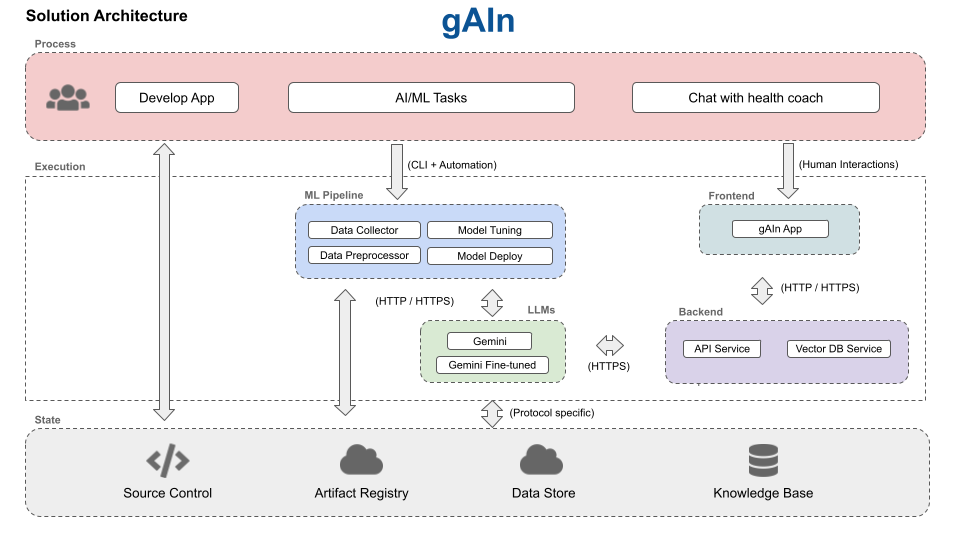
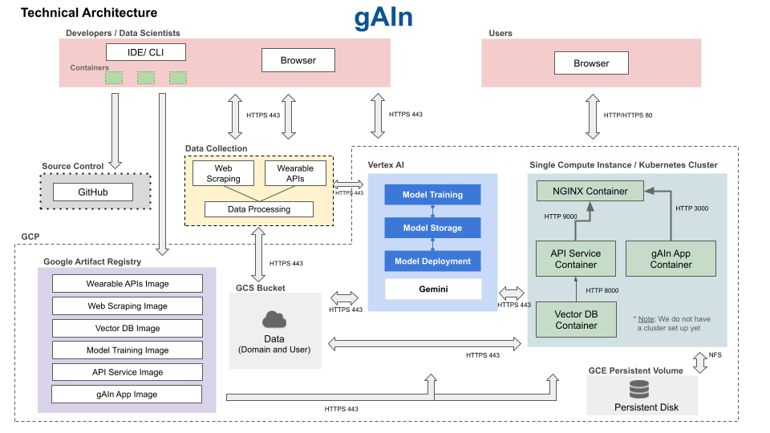
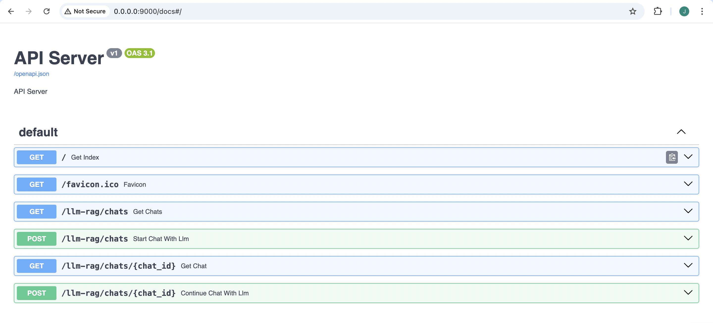
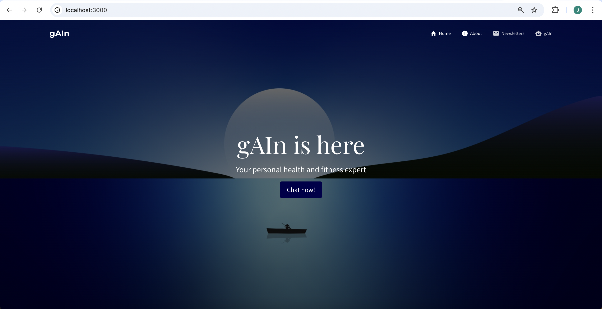
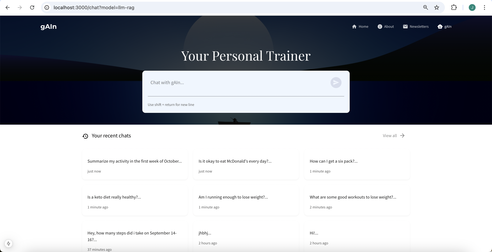
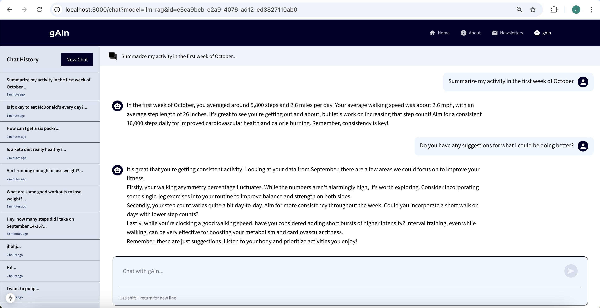

### gAIn Milestone 4 Organization

```
Below is an overview of the gAIn source code repository.
```

```
├── README.md
├── reports
│   ├── Planning and Components.pdf
│   └── Milestone 1.pdf
|   └── Milestone 3.pdf
└── src
    ├── data_preprocessing
    │   ├── Dockerfile
    │   ├── Pipfile
    │   ├── Pipfile.lock
    │   ├── docker-shell.sh
    │   ├── env.dev
    │   ├── cli.py
    │   ├── redirect.py
    │   ├── strava_api.py
    │   ├── csv_to_txt.py
    │   ├── README.md
    ├── datapipeline
    │   ├── Dockerfile
    │   ├── Pipfile
    │   ├── Pipfile.lock
    │   ├── dataloader.py
    │   ├── docker-shell.sh
    │   ├── preprocess_cv.py
    │   └── preprocess_rag.py
    ├── data_scraping
    │   ├── Dockerfile
    │   ├── Pipfile
    │   ├── Pipfile.lock
    │   ├── docker-shell.sh
    │   ├── find_urls.py
    │   ├── scrape.py
    │   ├── send_to_bucket.py
    │   └── README.md
    ├── dataset_creator
    │   ├── Dockerfile
    │   ├── Pipfile
    │   ├── Pipfile.lock
    │   ├── env.dev
    │   ├── docker-shell.sh
    │   ├── cli.py
    │   └── README.md
    ├── model_finetuner
    │   ├── Dockerfile
    │   ├── Pipfile
    │   ├── Pipfile.lock
    │   ├── env.dev
    │   ├── docker-shell.sh
    │   ├── cli.py
    │   └── README.md
    ├── docker-compose.yml
    ├── frontend
    ├── models
    │   ├── Dockerfile
    │   ├── docker-shell.sh
    │   ├── infer_model.py
    │   ├── model_rag.py
    │   └── train_model.py
    └── workflow
```

# AC215 - gAIn

**Team Members**
Vincent Hock, Tomas Arevalo, Jake Carmine Pappo, Mads Groeholdt

**Group Name**
gAIn - The future of health and fitness

**Project**
With the gAIn application, we seek to fill an existing gap in the health and fitness industry by providing users with an affordable, knowledgeable, and context-aware AI-enabled personal trainer. Our trainer seeks to replace expensive, thin-stretched personal trainers and fitness coaches, and provides an easier solution for those seeking to educate themselves compared to relying on the internet's scathered, unverified information. The main functionality of the app is a chat interface with the intelligent assistant, where users can ask their coach for advice, training plans, and more. The coach improves on other LLM's in the area of health and fitness by both being fine-tuned on quality-checked expert resources, as well as having access to each user's historical activity and fitness data powered by an AI-agent.

---

### Milestone 4

In this milestone, we have the components for the backend (i.e., our RAG-LLM model), the API service, and the frontend. Also included are other components from previous milestones, such as data storage and versioning.

After building a robust ML Pipeline in our previous milestone, we have now built a backend api service and frontend app. This will be our user-facing application that ties together the various components built in previous milestones.

**Application Design**

Before we start implementing the app we built a detailed design document outlining the application’s architecture. We built a Solution Architecture and Technical Architecture to ensure all our components work together.

Here is our Solution Architecture:



Here is our Technical Architecture:



**Backend API**

We built backend api service using fast API to expose model functionality to the frontend. We also added APIs that will help the frontend display some key information about the model and data. As seen below, this routes the information from our backend (e.g., LLM-generated text), which can then be delivered to a user-facing frontend application.



**Frontend**

A user-friendly React app was built to identify various species of mushrooms in the wild using computer vision models from the backend. Using the app a user can take a picture of a mushroom and upload it. The app will send the image to the backend api to get prediction results on weather the mushroom is poisonous or not.

Here are some screenshots of our app:






## gAIn Application Setup Guide

Welcome to the gAIn platform! Follow these steps to get the application up and running.

---

### Prerequisites

1. **Secrets Folder:**

   - Ensure you have a `secrets` folder in the directory `AC215_gAIn/src`.
   - This folder should contain the file `llm-service-account.json`.

2. **Directory Structure:**
   - Navigate to `AC215_gAIn/src` where you will find the following folders:
     - `vector_db`
     - `api_service`
     - `frontend_react`

---

### Setup Instructions

#### 1. Prepare the Vector Database

1. Change your working directory to the `vector_db` folder:

   ```bash
   cd vector_db

   ```

2. Start the container by running:

   ```bash
   sh docker-shell.sh

   ```

3. Inside the container, preprocess the user data by running:
   ```bash
   python cli.py --preprocess
   ```
   - This downloads the data from GCS, then chunks, embeds, and uploads it to ChromaDB
   - The default chunking method is `recursive-split`, but you can also try semantic splitting by adding `--chunk_type semantic-split`

#### 2. Start the Backend API Service

1. Open a **new terminal** and navigate to the `api_service` folder

2. Start the docker container by running:

   ```bash
   sh docker-shell.sh

   ```

3. Inside the container, expose the backend API server:
   ```bash
   uvicorn_server
   ```

#### 3. Start the Frontend Web Application

1. Open another **new terminal** and navigate to the `frontend_react` folder

2. Start the docker container by running:

   ```bash
   sh docker-shell.sh

   ```

3. (Optional) If this is your first time setting up the application, install the necessary dependencies:

   ```bash
   npm install

   ```

4. Start the local development server:
   ```bash
   npm run dev
   ```

---

### Accessing the Application

- Open your browser and navigate to:
  **[http://localhost:3000/](http://localhost:3000/)**

- Explore the features:
  1. **Home Page:** Learn about gAIn and its mission.
  2. **Newsletters Page:** Explore articles and blogs (content pending population).
  3. **AI Chat Assistant:**
     - Chat with gAIn about health and fitness topics.
     - gAIn has access to Mads’s Strava data for personalized recommendations and insights.

---

---

### Prerequisites

1. **Secrets Folder:**

   - Ensure you have a `secrets` folder in the directory `AC215_gAIn/src`.
   - This folder should contain the file `llm-service-account.json`.

2. **Directory Structure:**
   - Navigate to `AC215_gAIn/src` where you will find the following folders:
     - `vector_db`
     - `api_service`
     - `frontend_react`

---

### Setup Instructions

#### 1. Prepare the Vector Database

1. Change your working directory to the `vector_db` folder:

   ```bash
   cd vector_db

   ```

2. Start the container by running:

   ```bash
   sh docker-shell.sh

   ```

3. Inside the container, preprocess the user data by running:
   ```bash
   python cli.py --preprocess
   ```
   - This downloads the data from GCS, then chunks, embeds, and uploads it to ChromaDB
   - The default chunking method is `recursive-split`, but you can also try semantic splitting by adding `--chunk_type semantic-split`

#### 2. Start the Backend API Service

1. Open a **new terminal** and navigate to the `api_service` folder

2. Start the docker container by running:

   ```bash
   sh docker-shell.sh

   ```

3. Inside the container, expose the backend API server:
   ```bash
   uvicorn_server
   ```

#### 3. Start the Frontend Web Application

1. Open another **new terminal** and navigate to the `frontend_react` folder

2. Start the docker container by running:

   ```bash
   sh docker-shell.sh

   ```

3. (Optional) If this is your first time setting up the application, install the necessary dependencies:

   ```bash
   npm install

   ```

4. Start the local development server:
   ```bash
   npm run dev
   ```

---

### Accessing the Application

- Open your browser and navigate to:
  **[http://localhost:3000/](http://localhost:3000/)**

- Explore the features:
  1. **Home Page:** Learn about gAIn and its mission.
  2. **Newsletters Page:** Explore articles and blogs (content pending population).
  3. **AI Chat Assistant:**
     - Chat with gAIn about health and fitness topics.
     - gAIn has access to Mads’s Strava data for personalized recommendations and insights.

## Pushing Dockerfile to Google Cloud Artifact Registry

Add the below `docker-push.sh` file to a folder that has the Dockerfile for the image you want to add to the project's artifact registry.

```sh
#!/bin/bash
set -e

PROJECT_ID="ac215-final-project"
REGION="us-central1"
REPO_NAME="gcf-artifacts"
IMAGE_NAME="image-name" # Put your image name here

# Tag the image for Artifact Registry
docker build -t $IMAGE_NAME .
docker tag $IMAGE_NAME $REGION-docker.pkg.dev/$PROJECT_ID/$REPO_NAME/$IMAGE_NAME

# Push the image to Artifact Registry
docker push $REGION-docker.pkg.dev/$PROJECT_ID/$REPO_NAME/$IMAGE_NAME
```

Then run `sh docker-push.sh` to build the image and add it to the registry.

---

You may adjust this template as appropriate for your project.
