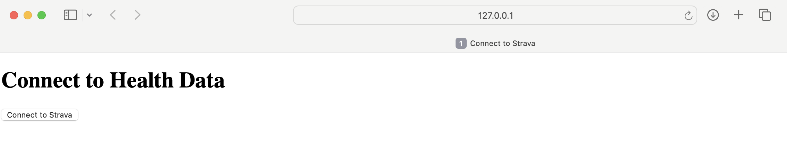
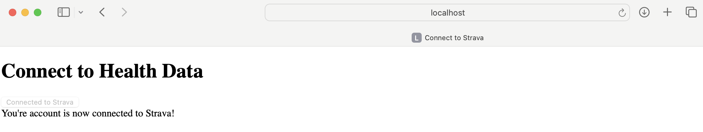

## Strava Data Pre-Processing
Run this container if you wish to get user-specific Strava data, preprocess it, and then upload it to a GCP bucket

### Container Set-Up
Run the startup script which makes building & running the container easy.

- Make sure you are inside the `data_preprocessing` folder and open a terminal at this location
- Run `sh docker-shell.sh`
- After container starts up, test the shell by running `python cli.py --help`

Create a secrets folder at the same level as the `src` folder.
This folder should contain:
- data_preprocessing.json: The credentials file connected to a gAIn GCP Service account with the necessary permissions:
  - `Storage Admin`
  - `Secret Manager Admin`
  - `Vertex AI Administrator`
- strava_config.json: Contains our Strava API's `client_id` and `client_secret` which allows a user to connect their Strava account to gAIn
  - Current Implementation now works by storing these Strava secrets in the GCP Secret Manager

### Authenticate Strava Account
- Run `python cli.py --authenticate`
- Pull the existing secrets from the Secrets Manager in GCP
- Sets up a local HTTP server to capture the authorization code
- Automatically opens a Strava authorization URL in a web browser allowing the user to sign into their Strava account, and accept the required permissions
  - If the link isn't automatically opened, it will print in the terminal which you can command+click on it to open it in your browser
- If the user successfully signs in and accpets the permissions, an `access_token`, `refresh_token`, and `expires_at` value are generated, and a new version of the secrets is uploaded to the GCP Secrets manager
  - Before uploading, it checks if a current valid `access_token` exists, and if so simply returns and doesn't go through the process of submitting the POST request for a new token via a `refresh_token`

### Fetch Strava Data
- Run `python cli.py --fetch_data`
- Checks if the current `access_token` is expired, and if so, generates a new one using the `refresh_token`
  - Uploads the new `access_token` and `expires_at` to the GCP Secrets manager
- Using the `access_token`, submits a GET request to get all of the user's Strava activities and stores then in a `.csv` file
- The naming convention for each file is `firstname_lastname_souce_data.csv`
  - ex: `John_Doe_strava_data.csv`

### Generate .txt files (Pre-Processing for RAG)
- Run `python cli.py --generate`
- Uses the `.csv` file generated in the previous step to generate a formatted `.txt` file summarizing health and activity metrics for a given individual. The summary is formatted with:
  - **Date Formatting:** The date is converted into a human-readable format with a proper suffix (e.g., "st", "nd", "rd", "th").
  - **Header Creation:** Each entry starts with a header indicating the date and individual's name, derived from the filename.
  - **Metric Output:** Health and activity metrics are listed with values and optional units extracted from column headers.
- The naming convention for each file is `firstname_lastname_souce_data.txt`
  - ex:`John_Doe_strava_data.txt`

### Upload to GCP Bucket
- Run `python cli.py --upload`
- Uploads both the generated `.csv` and `.txt` files to a GCP bucket
- `.csv` files go to a folder within the bucket called `processed_user_data/firstname_lastname/`
  - ex: `processed_user_data/John_Doe/John_Doe_strava_data.csv`
- `.txt` files go to a folder within the bucket called `raw_user_data/firstname_lastname/`
  - ex: `processed_user_data/John_Doe/John_Doe_strava_data.txt`

### Run Entire Pre-Processing Pipeline
- Run `python cli.py`
- Runs the entire pipeline, including authentication, data-fetching, generating pre-processed data, and uploading the data

### Run Entire Pre-Processing Pipeline via Flask
- Run `python flask_app.py` and open the HTTP server (http://127.0.0.1:8080) that is hosting the front end
- This a simple HTML template with a button, that if you click, triggers the entire data preprocessing pipleine
  - Once the button is clicked, the user is redirected to a Strava Auth URL where they can login, accept permissions, and are then redirected back to the original button page via the `/callback` route being triggered. Upon return to the orginal page, the button is now disabled, and a message saying "You're account is now connected to Strava!" appears below it.
    - Uploads new version of the strava secrets to the Secrets Manager in GCP
    - Triggers the rest of the pipeline essentially invoking `python cli.py --fetch_data --generate --upload`
  - To renable the button, simply get rid of the `/?connected=true` in the link

### Unlink Strava Account
- Within `strava_api.py` the function `unlink_strava(project_num, secret_name)` simply gets rid of the `access_token`, `refresh_token`, and `expires_at` value from the secrets it downloads from GCP, and then uploads the new version to the GCP Secrets Manager
  - If you want to run this function, type `python` into the terminal and press enter which opens a python interpreter
  - Type `import os` and press enter
  - Type `from strava_api import unlink_strava` and press enter
  - Type `PROJECT_NUM, SECRET_NAME = os.getenv("PROJECT_NUM"), os.getenv("SECRET_NAME")` and press enter
  - Type `unlink_strava(PROJECT_NUM, SECRET_NAME)` and press enter
