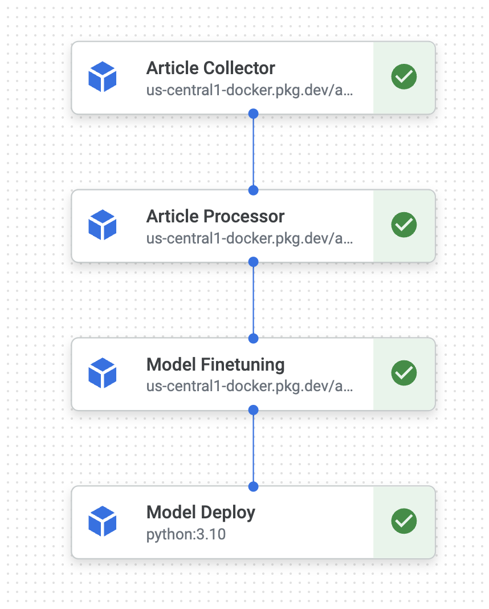
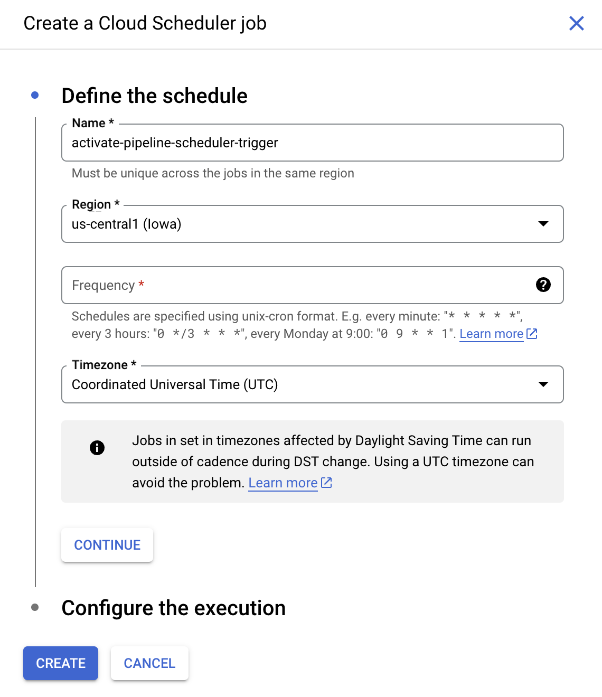

# ML Pipeline

The machine learning pipeline runs on regularly scheduled intervals; a Google Cloud Run job activates the workflow once per week. The Vertex AI pipeline collects a number of health and fitness articles from across the internet, processes them into Question-Answer pairs, and finetunes the existing gAIn model on the new data.

## Pipeline Description

The pipeline is divided into 4 distinct containers, each serving a unique function in the machine learning process:
- article-collector
- article-processor
- model-finetuning
- workflow

### Article Collector

The first step of the pipeline involves finding and scraping articles from across the internet. The `get_urls(N)` function uses an OpenAI agent to collect links to `N` recently-published, publicly accessible articles about health, fitness, diet, and exercise. The CSV containing these links is saved to a folder within the `ml-pipeline` GCS bucket.

The `scrape()` function then iterates through every link within this saved CSV and gets the useful content from each article. This content is saved to the `raw_articles` folder on GCS.

### Article Processor

The article processor container is responsible for converting the raw content of the scraped articles into labeled data that is compatible with Vertex AI's supervised fine-tuning functionality. Question-answer training data is necessary, as the goal is to instruct the base model on the subject matter and make it an expert in the field of health.

The `generate()` function accepts the raw content and passes it to a Generative Model with specific system instructions, describing the tone and behavior that the generative model should exhibit. The system instructions also carefully detail the output format of the QA pairs, so that they can be converted into Vertex AI's desired format.

The pipeline then `prepare()`'s the training data into `.jsonl` files that can be passed into Vertex AI before `upload()`ing the data to the `processed_data` folder in the GCS Bucket.

### Model Finetuning

This container begins the Vertex AI Tuning job on GCP, using the `processed_data` files as the labeled data to train the model.

### Workflow

In the `workflow` container we create 5 Kubeflow pipelines; one for activating the pipeline in it's entirety, as well as one for activating each individual step of the pipeline separately. The steps should only be carefully deployed individually for testing purposes, as the training process strictly requires each step to be activated in order.

It is also within this container that the newly-finetuned model is deployed to the `gain-finetuned` endpoint. This allows the model to seamlessly integrate with the gAIn backend API without having to change the endpoint that the website accesses.

## Deploying Changes

The Vertex AI pipeline job runs the container image for each step of the process. Thus, to save changes to the code, these images must be updated and pushed to the GCP Artifact Registry. This is done automatically through `docker-push.sh` files within each container. These `sh` files are activated with every push to the `gAIn` GitHub, and so changes to the pipeline can be made by simply pushing changes.

## Activating the Pipeline Locally

### Secrets

Create a secrets folder at the same level as the `src` folder. (That is, `$(pwd)/../../../secrets/`)

This folder should contain:
 - ml-pipeline.json: The credentials file connected to a gAIn GCP Service account with the necessary permissions:
    - `AI Platform Admin`
    - `Cloud Scheduler Admin`
    - `Secret Manager Admin`
    - `Service Account User`
    - `Storage Admin`
    - `Vertex AI Administrator`

### Running Individual Containers

Ensure that Docker is installed on your device. Within the folder corresponding to the desired container, open a terminal.

- Run `sh docker-shell.sh`
- After container startup, test the shell by running `python cli.py --help`. This will tell you how to execute the available command, each described above, in order to execute individual steps of the pipeline.

### Running the Entire Pipeline

- Run `sh docker-shell.sh` within the `workflow` terminal.
- Execute `python cli.py --pipeline X`, where `X` is the number of articles desired for this tuning instance.

## ML Pipeline Scheduling

The Vertex AI Pipeline is activated by a Cloud Run job hosting the `workflow` container. The Cloud Scheduler API enables scheduler triggers, meaning that the Cloud Run job can be "triggered" (ie. executed) on a regular interval.

The current schedule triggers the Cloud Run job every Sunday at 12:00 UTC, but the schedule can easily be changed from the "Triggers" tab within the job:

Note: It is also possible to manually execute the job, but this is not recommended unless urgent training is required.
